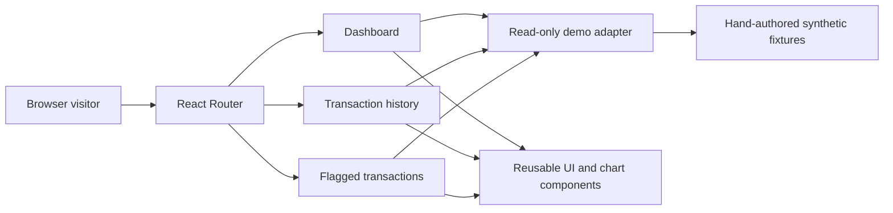
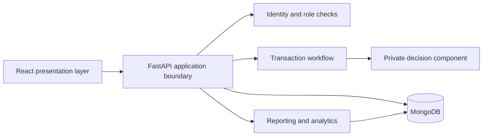

# FraudShield

### Transaction intelligence, made visible.

A public, read-only proof of concept for a transaction-monitoring interface.
Explore a responsive dashboard, inspect flagged transactions, and understand
the system-design decisions behind a full-stack financial technology project.

**React · Vite · Tailwind CSS · Recharts · Component-based UI · API contracts**

> **Demo scope:** every transaction, risk score, and outcome in this repository
> is synthetic. This version does not process payments, run a fraud model,
> authenticate users, or connect to a bank or database. It requires no secrets.

## Why this project exists

A risk score is only useful when people can understand and act on it. FraudShield
explores how transaction summaries, risk categories, and review queues can be
presented together in a focused operational interface.

The public project demonstrates the presentation layer and its data contract.
A separate private implementation contains the application backend, detection
logic, model artifacts, and commercial integrations. Keeping those concerns
separate makes the UI and architecture reviewable without publishing the core
implementation.

## What you can explore

- **Monitoring dashboard:** total transaction count, flagged count, and average
  illustrative risk score, all calculated from the same fixture set.
- **Monthly trends:** transaction and flagged-case counts grouped by month.
- **Risk distribution:** a chart of predefined sample risk categories.
- **Review queue:** a read-only table of flagged synthetic transactions.
- **Transaction history:** all sample records with amounts, statuses, and scores.
- **Light and dark themes:** reusable cards, badges, tables, and chart elements.
- **Transparent demo mode:** a persistent banner and an explanation page make
  it clear that no live banking or security service is running.

## Repository boundary

| Area | Public proof of concept | Private implementation |
| --- | --- | --- |
| Selected dashboard and transaction UI | Included | Included |
| Generic presentation components | Included | Included |
| New synthetic display fixtures | Included | Not the training dataset |
| Architecture and system-design documentation | Included | Included |
| Read-only, in-browser data adapter | Included | Not the backend |
| Authentication and authorization implementation | Not included | Retained |
| Transaction decision logic and proprietary algorithms | Not included | Retained |
| Training data, trained models, encoders, and inference | Not included | Retained |
| Payment, pricing, marketplace, and monetization flows | Not included | Retained |
| Receipt-processing implementation | Not included | Retained |
| Credentials, private keys, and personal data | Never included | Never included |

The repositories have independent Git histories. This repository is not a
private-repository branch, filtered history, or submodule. Public updates must
be reviewed independently; a private branch must never be merged here.

## Quick start

Requirements: Node.js 22 or newer and npm.

```bash
cd frontend
npm ci
npm run dev
```

Open the local address printed by Vite. The application starts directly at the
demo dashboard. No account, API key, database, Python environment, or backend
process is needed.

```bash
# Verify the demo adapter and its synthetic fixtures
npm test

# Produce a static production bundle
npm run build

# Preview that bundle locally
npm run preview
```

Tests cover summary consistency, ordering and pagination, response isolation,
chart reconciliation, rejected routes, unique record IDs, and reserved example
email addresses. The included GitHub Actions workflow runs tests and a build;
its remote result should be checked after each push.

## Architecture of the public demo



The adapter is a local JavaScript module, not an HTTP server. Its asynchronous
`get(path)` method returns `{ data }` to preserve a familiar data-access boundary
for the UI. It performs **no network requests** and does not run a classifier.
Responses are copied before being returned so consumers cannot modify the
shared fixture set.

The only calculations are display aggregates: counts, averages, and monthly
grouping. Risk scores, categories, and statuses are authored fixtures, not
outputs of the private decision engine. No risk thresholds are disclosed.

## Broader application design

At a high level, the original implementation combines a React frontend, a
Python/FastAPI application, and MongoDB persistence. Model inference currently
runs inside the backend process rather than as a separate microservice.



This diagram describes responsibilities, not a production deployment or a claim
that every boundary is fully hardened. The public adapter demonstrates the
read-side interaction only. The private decision component is intentionally
treated as a black box: its rules, features, thresholds, and training artifacts
are outside this repository.

See [System design](docs/SYSTEM_DESIGN.md) for component responsibilities, data
flow, consistency choices, deployment considerations, and trade-offs.

## Cloud relevance

This project distinguishes **cloud-compatible structure** from **completed
cloud deployment**.

The public demo builds to static assets, so it could be served by static hosting
and a CDN. A fuller application could place the backend on managed application
compute and use a managed database such as MongoDB Atlas. These are future
deployment options, not services provisioned by this repository.

| Application concern | Possible cloud responsibility | Current public implementation |
| --- | --- | --- |
| Frontend delivery | Static hosting and CDN | Vite static build |
| API execution | Managed application or container compute | No backend |
| Data persistence | Managed database | In-browser fixtures |
| Configuration | Managed secrets and environment configuration | No credentials required |
| Operational visibility | Logs, metrics, alerts, and tracing | No production monitoring |
| Delivery pipeline | Build/test automation and release controls | Test/build workflow only |

Scaling the private application would require more than hosting it: persistence,
request limits, process-local state, inference cost, connection management,
observability, and security need to be reviewed. Separating inference into an
independent service is a possible future design, not the current architecture.

## Project structure

```text
fraudshield/
├── .github/workflows/ci.yml       # Public demo test/build checks
├── docs/
│   ├── API_CONTRACT.md            # Read-side demo response shapes
│   └── SYSTEM_DESIGN.md           # Architecture and trade-offs
├── frontend/
│   ├── src/
│   │   ├── components/ui/        # Selected reusable presentation components
│   │   ├── demo/                 # Independent fixtures and local adapter
│   │   ├── lib/                  # Styling utilities
│   │   ├── pages/                # Dashboard and read-only transaction screens
│   │   └── App.jsx               # Routes, demo banner, and explanation page
│   ├── tests/                    # Adapter and fixture checks
│   └── package.json
├── SECURITY.md
└── README.md
```

## Security and privacy

- No credentials or real customer records are needed to run the demo.
- Example email addresses use the reserved `example.com` domain.
- There are no payment SDKs, login forms, account-creation flows, or transaction
  mutation endpoints in this edition.
- The visible analyst label is a demonstration persona, not authorization.
- Do not connect this demo to a private production API by simply changing a URL.
  A real integration needs an intentional authentication, authorization,
  validation, error-handling, and privacy design.
- Never upload `.env` files, credential files, private keys, training artifacts,
  or private repository history. See [Security notes](SECURITY.md).

## Limitations and next steps

The demo is intentionally read-only, uses a small fixture set, and does not
demonstrate real-time fraud detection, bank settlement, OTP delivery, model
accuracy, or production throughput. Repeated UI refreshes read the same fixture
set. No accuracy or latency benchmark is claimed.

Potential public improvements include accessibility testing, additional screen
sizes, empty/error-state coverage, and a larger set of independently authored
demo scenarios. Private implementation improvements should stay in the private
repository unless explicitly reviewed for release.

## Skills demonstrated

React, JavaScript, Vite, Tailwind CSS, reusable component design, data
visualization, asynchronous data adapters, API-contract design, automated
testing, repository security boundaries, and cloud architecture concepts.

The broader private project also involves Python, FastAPI, MongoDB, machine
learning integration, identity workflows, and receipt processing. Their code is
not part of this public proof of concept.

## Author and reuse

Maintained by [cobraroot404-a11y](https://github.com/cobraroot404-a11y).
This repository does not include an open-source license grant. Third-party
dependencies remain subject to their respective licenses. Contact the owner
before reusing original project code beyond rights provided by applicable terms.
